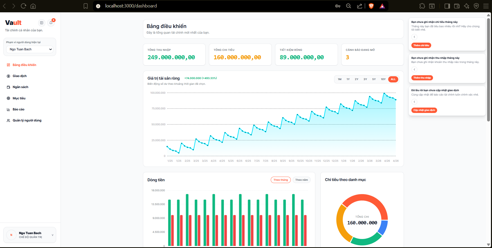

# Personal Finance Management System (Personal_Finance)

Personal Finance Management System is the main project name. The deployed web application is branded as **Vault**.

## Motivation
This project was developed as the final assignment for the **Database Management Systems** course at National Economics University (NEU). It aims to demonstrate comprehensive database design, implementation of business logic via SQL (views, procedures, triggers), and integration with a modern full-stack application.

## Dashboard Preview


The system uses MySQL + Python service layer, with:

- API layer: FastAPI (`backend/`)
- Web UI: Next.js (`frontend/`)

Public links:

- Deployed website: `https://vaulted.up.railway.app/login`
- Demo video: `https://youtu.be/eOIub3bRHTI`

Database name is fixed and must remain:

```text
Personal_Finance
```

## 1. Scope and Features

Core modules currently implemented:

- Authentication and session handling
- User profile management
- Income / Expense CRUD
- Budget planning and spending guardrails
- Spending alerts
- Goals and goal contributions
- Reports (daily / monthly / yearly, category spending, balance history)
- Bank catalog and bank-linked account setup
- CSV/Excel transaction import preview + confirm (via backend APIs and transactions UI flow)

## 2. Tech Stack

- MySQL 8
- Python
  - FastAPI
  - mysql-connector
- Next.js + TypeScript + Tailwind
- Docker / Docker Compose

## 3. Repository Structure

```text
database/
  schema.sql
  sample_data.sql
  views.sql
  procedures.sql
  functions.sql
  triggers.sql
  security.sql
  migrations/

python_app/          # shared core service/repository modules
backend/             # FastAPI API
frontend/            # Next.js frontend
  src/
    app/
    components/
    lib/
    providers/
    types/
ops/                 # helper scripts (bootstrap/reset)
docs/
  13.pdf             # assignment source
  main.tex           # LaTeX report source
  slide_sql.tex      # LaTeX presentation slide source
  presentation_note.txt
  ERD/               # ERD images
  figures/           # report/slide screenshots
  VIDEO/             # demo video assets
```

## 4. Prerequisites

- Docker Desktop (recommended path)
- Or local:
  - Python 3.11+
  - Node.js 18+
  - npm

## 5. Environment Setup

Use env template:

```powershell
Copy-Item .env.docker.example .env
```

Fill required values in `.env`:

- `MYSQL_ROOT_PASSWORD`
- `PF_ADMIN_EMAIL`
- `PF_ADMIN_PASSWORD`
- `SMOKE_ADMIN_EMAIL`
- `SMOKE_ADMIN_PASSWORD`

Optional ports:

- `MYSQL_LOCAL_PORT` (default `3307`)
- `BACKEND_LOCAL_PORT` (default `8000`)
- `FRONTEND_LOCAL_PORT` (default `3000`)

## 6. Run with Docker (Recommended)

### 6.1 First setup with a fresh database

Use this path when starting from an empty Docker volume or when you intentionally want to rebuild the local database from SQL files.

```powershell
docker compose up -d db
docker compose run --rm db-reset
docker compose run --rm bootstrap-admin
docker compose up -d --build backend frontend
docker compose run --rm smoke-test
```

What this does:

- `db` starts MySQL 8 with database name `Personal_Finance`.
- `db-reset` runs the SQL setup scripts from `database/`.
- `bootstrap-admin` creates or updates the first admin credential from `.env`.
- `backend frontend` starts the FastAPI API and Next.js web UI.
- `smoke-test` verifies authentication and core database/service workflows.

### 6.2 Normal daily start

Use this when the database is already initialized and you only want to start the app.

```powershell
docker compose up -d db backend frontend
```

Access services:

- FastAPI docs: `http://localhost:8000/docs`
- Next.js: `http://localhost:3000`

### 6.3 After changing frontend code only

Use this when you changed files under `frontend/`.

```powershell
docker compose up -d --build frontend
```

### 6.4 After changing backend code only

Use this when you changed files under `backend/` or shared service/repository code under `python_app/`.

```powershell
docker compose up -d --build backend
```

If the frontend depends on a changed API response, rebuild both:

```powershell
docker compose up -d --build backend frontend
```

### 6.5 After changing SQL views only

Use this when you changed `database/views.sql`.
Do not reset the whole database just to update views.

```powershell
docker compose run --rm db-apply-views
docker compose restart backend
```

Run smoke test if the changed views affect dashboard, reports, budgets, alerts, goals, or balance history:

```powershell
docker compose run --rm smoke-test
```

### 6.6 After changing schema, sample data, procedures, functions, triggers, or security SQL

If you are still in local development and do not need to keep current local data, the fastest clean path is:

```powershell
docker compose down -v
docker compose up -d db
docker compose run --rm db-reset
docker compose run --rm bootstrap-admin
docker compose up -d --build backend frontend
docker compose run --rm smoke-test
```

Use `down -v` carefully: it deletes the Docker MySQL volume and all local database data.

If you need to keep existing data, do not run `down -v`.
Create or run an incremental migration from `database/migrations/` instead.
Example:

```powershell
docker cp .\database\migrations\011_add_goal_expense_categories.sql personal_finance_mysql:/tmp/011_add_goal_expense_categories.sql
docker exec personal_finance_mysql sh -lc 'export MYSQL_PWD="$MYSQL_ROOT_PASSWORD"; mysql --default-character-set=utf8mb4 -uroot Personal_Finance < /tmp/011_add_goal_expense_categories.sql'
docker compose restart backend
```

### 6.7 Common Docker mistakes and fixes

- `MYSQL_ROOT_PASSWORD variable is not set`
  - Fix: copy `.env.docker.example` to `.env` and fill required values.
  - Command:
    ```powershell
    Copy-Item .env.docker.example .env
    ```

- Login works locally before reset, but fails after `db-reset`
  - Cause: credentials are recreated from `.env`.
  - Fix: run bootstrap again and make sure `PF_ADMIN_EMAIL` and `PF_ADMIN_PASSWORD` are correct.
    ```powershell
    docker compose run --rm bootstrap-admin
    ```

- Dashboard, reports, budgets, alerts, or goals still show old SQL behavior after editing `views.sql`
  - Cause: MySQL views in the running DB were not recreated.
  - Fix:
    ```powershell
    docker compose run --rm db-apply-views
    docker compose restart backend
    ```

- Frontend still shows old UI after code changes
  - Cause: frontend image was not rebuilt.
  - Fix:
    ```powershell
    docker compose up -d --build frontend
    ```

- Backend still returns old API behavior after code changes
  - Cause: backend image was not rebuilt.
  - Fix:
    ```powershell
    docker compose up -d --build backend
    ```

- MySQL Vietnamese text or emoji looks broken only in a SQL client
  - Cause: client/session charset is not `utf8mb4`.
  - Fix before querying:
    ```sql
    SET NAMES utf8mb4 COLLATE utf8mb4_0900_ai_ci;
    ```
  - Or connect with:
    ```powershell
    mysql --default-character-set=utf8mb4 -uroot -p Personal_Finance
    ```

- Need to inspect container status
  - Command:
    ```powershell
    docker compose ps
    ```

- Need to inspect backend logs
  - Command:
    ```powershell
    docker compose logs --tail=120 backend
    ```

## 7. Local Development (without Docker)

### 7.1 Backend

```powershell
python -m venv .venv
.\.venv\Scripts\Activate.ps1
pip install -r requirements.txt
pip install -r backend/requirements.txt
uvicorn backend.app.main:app --reload --host 0.0.0.0 --port 8000
```

### 7.2 Frontend

```powershell
cd frontend
npm install
npm run dev
```

## 8. Current Frontend Routes (Next.js)

Auth pages:

- `/login`
- `/signup`
- `/forgot-password`
- `/verify-otp-unlock`

App pages:

- `/dashboard`
- `/transactions` (includes manual input + import flow UI)
- `/budgets`
- `/goals`
- `/reports`
- `/profile`
- `/user-management` (admin)

## 9. FastAPI Route Groups

Base prefix: `/api/v1`

- `auth`: login/logout/me/signup/otp/recovery/password/profile
- `meta`: users/accounts/categories/banks
- `transactions`: transactions + incomes + expenses
- `imports`: preview/confirm/history
- `reports`: monthly/yearly/daily/category-spending/balance-history
- `dashboard`: overview
- `budgets`: plans/status/settings/overview/can-i-spend
- `alerts`: spending alerts
- `goals`: goals/progress/contributions
- `users`: admin profile CRUD

## 10. Database Assets

Main SQL files:

- `database/schema.sql`
- `database/sample_data.sql`
- `database/views.sql`
- `database/procedures.sql`
- `database/functions.sql`
- `database/triggers.sql`
- `database/security.sql`

Migrations:

- `database/migrations/001_add_banks_catalog.sql`
- `database/migrations/002_add_saving_goals.sql`
- `database/migrations/003_add_transaction_import_tables.sql`
- `database/migrations/004_smart_budget_guardrails.sql`
- `database/migrations/005_budget_settings_recurring_items.sql`
- `database/migrations/006_budget_fixed_expense_category_icons.sql`
- `database/migrations/007_fix_utf8_icons_and_vi_seed_data.sql`
- `database/migrations/008_force_utf8_vi_data.sql`
- `database/migrations/009_seed_paydown_goals_demo.sql`
- `database/migrations/010_add_transaction_goal_links.sql`
- `database/migrations/011_add_goal_expense_categories.sql`

## 11. Notes

- Product/web UI name: `Vault`.
- Assignment reference: `docs/13.pdf`.
- Report source and generated report are stored under `docs/`, including `report.tex`, `SQL_REPORT.pdf`, `ERD/`, `figures/`, and related screenshots.
- Presentation source is stored under `docs/slide_sql.tex` and `docs/SQL_SLIDE.pdf`.
- Demo/deployment links:
  - Website: `https://vaulted.up.railway.app/login`
  - Video: `https://youtu.be/eOIub3bRHTI`
- Do not rename database `Personal_Finance`.
